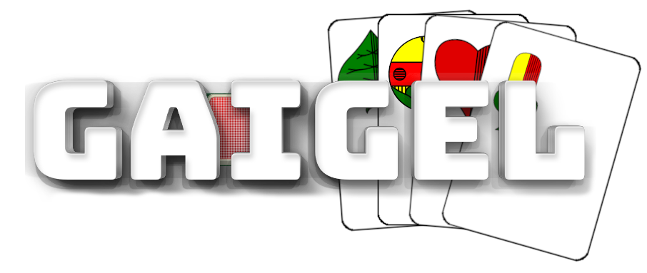

<!-- PROJECT GAIGEL -->
[![Contributors][contributors-shield]][contributors-url]
[![Forks][forks-shield]][forks-url]
[![Stargazers][stars-shield]][stars-url]
[![Issues][issues-shield]][issues-url]
[![MIT License][license-shield]][license-url]


<!-- PROJECT LOGO -->
<br />
<p align="center">
  <a href="https://github.com/DanielWidmayer/swabianGaigel">
    
  </a>

  <h3 align="center">Gaigel Webapp</h3>

  <p align="center">
    An awesome way to play Gaigel with your friends online, for free & without registration!
    <br />
    <br />
    <a href="https://github.com/DanielWidmayer/swabianGaigel">Play Now</a>
    ·
    <a href="https://github.com/DanielWidmayer/swabianGaigel/issues">Report Bug</a>
    ·
    <a href="https://github.com/DanielWidmayer/swabianGaigel/issues">Request Feature</a>
  </p>
</p>


<!-- TABLE OF CONTENTS -->
<details open="open">
  <summary>Table of Contents</summary>
  <ol>
    <li>
      <a href="#about-the-project">About The Project</a>
      <ul>
        <li><a href="#built-with">Built With</a></li>
      </ul>
    </li>
    <li>
      <a href="#getting-started">Getting Started</a>
      <ul>
        <li><a href="#prerequisites">Prerequisites</a></li>
        <li><a href="#installation">Installation</a></li>
      </ul>
    </li>
    <li><a href="#usage">Usage</a></li>
    <li><a href="#roadmap">Roadmap</a></li>
    <li><a href="#contributing">Contributing</a></li>
    <li><a href="#license">License</a></li>
    <li><a href="#contact">Contact</a></li>
    <li><a href="#acknowledgements">Acknowledgements</a></li>
  </ol>
</details>


<!-- ABOUT THE PROJECT -->
## About The Project

[![Product Name Screen Shot][product-screenshot]](https://example.com)

Gaigel is a traditionally swabian card game. However there is no website to play Gaigel online with your friends. This project implements a simple way to play Gaigel online. Its simple and easy. You don't need to register, just hop in and play.

:video_game: Here's why you should play:
* Play with your friends if you can't meet personally
* Flexible to Use: no account needed
* Free to Play (and no hidden ads, tracking or ingame purchases)
* Open Source: Simply improve the game by collaborating if you find any issues


### Built With

This section should list any major frameworks that you built your project using. Leave any add-ons/plugins for the acknowledgements section. Here are a few examples.
* [Bootstrap](https://getbootstrap.com)
* [JQuery](https://jquery.com)
* [Sails.js](https://sailsjs.com/)


<!-- GETTING STARTED -->
## Getting Started

To get a local copy up and running follow these simple steps.

### Prerequisites

This is an example of how to list things you need to use the software and how to install them.
* npm
```sh
npm install npm@latest -g
```
* sails.js
```sh
npm install sails -g
```

### Installation

1. Clone the repo
```sh
git clone https://github.com/DanielWidmayer/swabianGaigel.git
```
2. Install NPM packages
```sh
npm install
```
3. Run the server
```JS
sails lift
```


<!-- USAGE EXAMPLES -->
## Usage

[How to play](https://github.com/DanielWidmayer/swabianGaigel).

_For more, please refer to the [Documentation](https://github.com/DanielWidmayer/swabianGaigel)_


<!-- ROADMAP -->
## Roadmap :rocket:

See the [open issues](https://github.com/DanielWidmayer/swabianGaigel/issues) for a list of proposed features (and known issues).


<!-- CONTRIBUTING -->
## Contributing

Any contributions you make are **greatly appreciated**.

1. Fork the Project
2. Create your Feature Branch (`git checkout -b feature/AmazingFeature`)
3. Commit your Changes (`git commit -m 'Add some AmazingFeature'`)
4. Push to the Branch (`git push origin feature/AmazingFeature`)
5. Open a Pull Request


<!-- LICENSE -->
## License

Distributed under the MIT License. See `LICENSE` for more information.


<!-- CONTACT -->
## Contact

Daniel Widmayer - inf18157@lehre-dhbw-stuttgart.de

Project Link: [https://github.com/DanielWidmayer/swabianGaigel](https://github.com/DanielWidmayer/swabianGaigel)


<!-- ACKNOWLEDGEMENTS -->
## Acknowledgements
* [Card Library](https://github.com/richardschneider/cardsJS)
* [GitHub Emoji Cheat Sheet](https://www.webpagefx.com/tools/emoji-cheat-sheet)
* [Img Shields](https://shields.io)
* [Choose an Open Source License](https://choosealicense.com)
* [PrivacyPolicies](https://app.privacypolicies.com/)
* [Bootstrap Icons](https://icons.getbootstrap.com/)


<!-- MARKDOWN LINKS & IMAGES -->
<!-- https://www.markdownguide.org/basic-syntax/#reference-style-links -->
[contributors-shield]: https://img.shields.io/github/contributors/DanielWidmayer/swabianGaigel.svg?style=for-the-badge
[contributors-url]: https://github.com/DanielWidmayer/swabianGaigel/graphs/contributors
[forks-shield]: https://img.shields.io/github/forks/DanielWidmayer/swabianGaigel.svg?style=for-the-badge
[forks-url]: https://github.com/DanielWidmayer/swabianGaigel/network/members
[stars-shield]: https://img.shields.io/github/stars/DanielWidmayer/swabianGaigel.svg?style=for-the-badge
[stars-url]: hhttps://github.com/DanielWidmayer/swabianGaigel/stargazers
[issues-shield]: https://img.shields.io/github/issues/DanielWidmayer/swabianGaigel.svg?style=for-the-badge
[issues-url]: https://github.com/DanielWidmayer/swabianGaigel/issues
[license-shield]: https://img.shields.io/github/license/DanielWidmayer/swabianGaigel.svg?style=for-the-badge
[license-url]: https://github.com/DanielWidmayer/swabianGaigel/blob/master/LICENSE.txt  
[product-screenshot]: assets/images/headLogo.png


